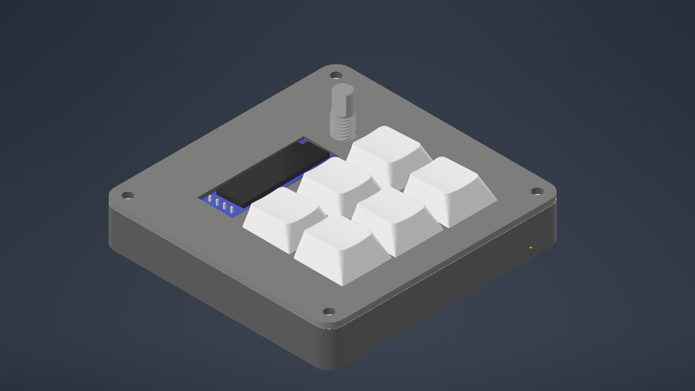
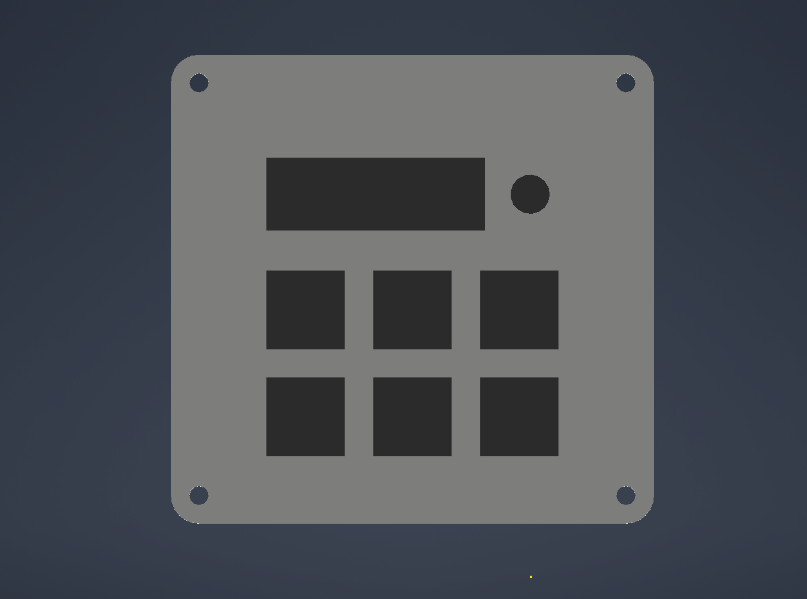
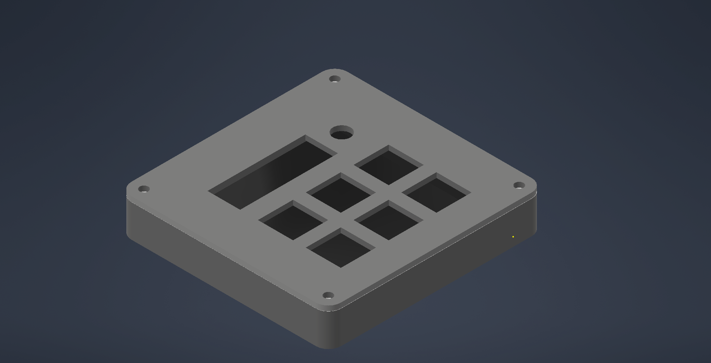
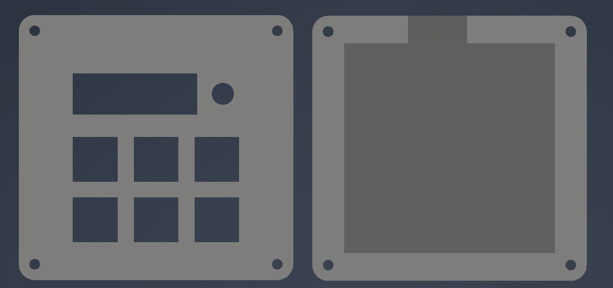
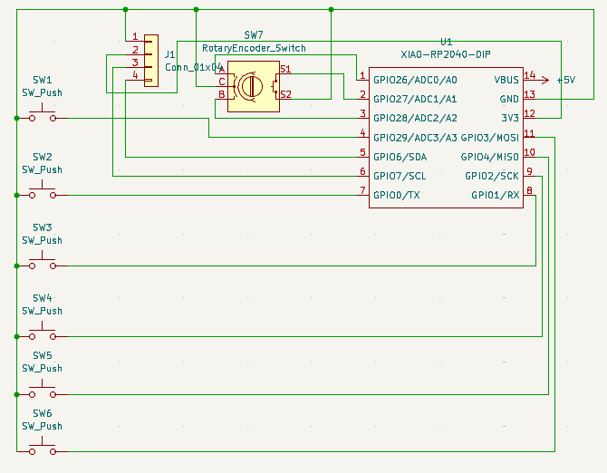
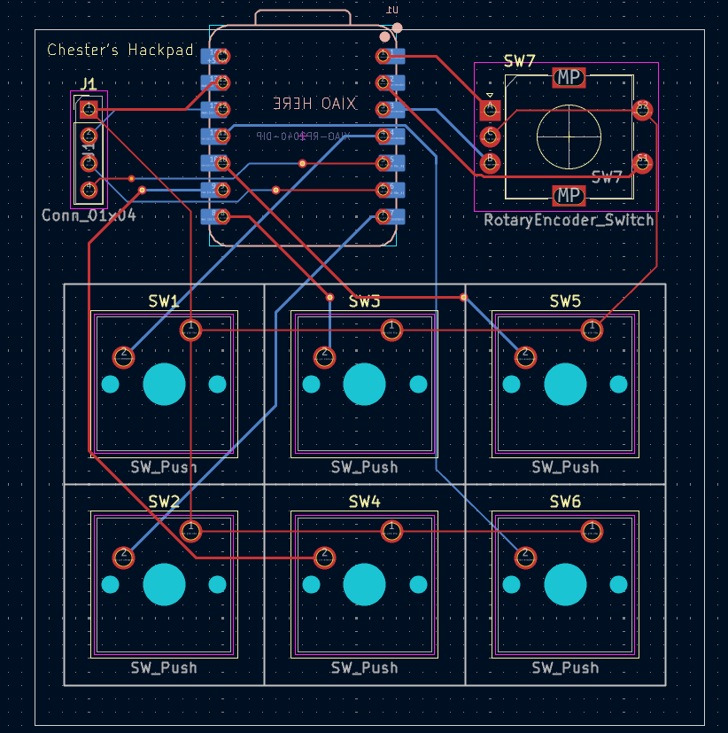

# Chesters-Hackpad
A custom PCB-based macropad built for the *Hack Club Blueprint program*.

It functions as a miniature media dashboard: the display shows the current track (TO BE IMPLEMENTED), the knob controls volume, and the six keys can be bound to any shortcut.

## The Hackpad

Everything fits together using 4 M3 Bolts and Heatset inserts, one in each corner. 

It has 2 separate printed pieces. The base, where the PCB sits, and the top cover, which protects the PCB.

## PCB
My PCB was designed in KiCad. The XIAO is mounted on the bottom of the PCB to allow space for the OLED display.

Schematic:

PCB:

## BOM:
- 1x Case 
- 1x XIAO RP2040
- 1x 0.91" 128x32 OLED Display
- 1x EC11 Rotary Encoder
- 6x Cherry MX Switches
- 6x DSA Keycaps
- 4x M3x5x4 Heatset inserts
- 4x M3x16mm SHCS Bolts